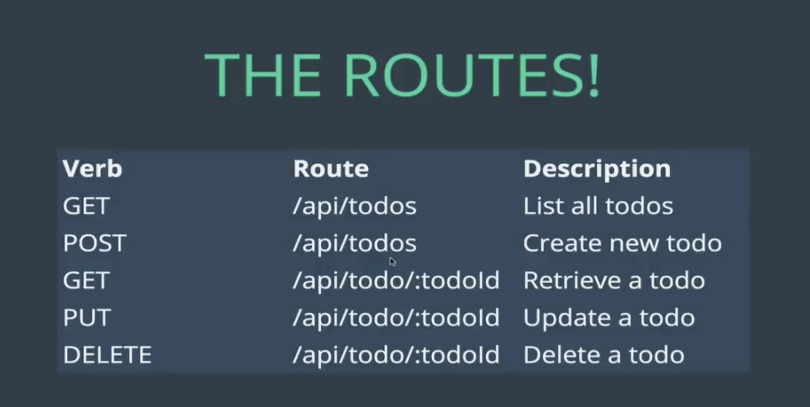

# Node-Todo

A simple todo list application built with Node.  

It uses a custom made todos REST API to get the list from MongoDB databse.  
This single page todo makes asyncronous calls using Jquery.   

Link: https://zen-rest-api.herokuapp.com    

## Todo API
It uses a custom REST todo api built on the following routes

### GET all todos

The request has to be sent to the `/api/todo` route to obtain a JSON list of all the quotes

### POST a todo

Send the request to `/api/todo` with the following body request parameters
1) name: String

The Post request can be sent in one of the following ways

1) POSTMan (https://www.getpostman.com)
2) API Tester (https://apitester.com)

### GET one quote
Send request to `/api/todo/:todoId` where the TodoId is the ID of the todo

### PUT one quote
Send the PUT request to `/api/todo/:todoId` to update the todo

### DELETE one quote
Send the DELETE request to `/api/todo/:todoId` to delete one todo.

